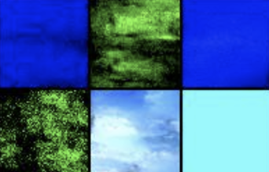
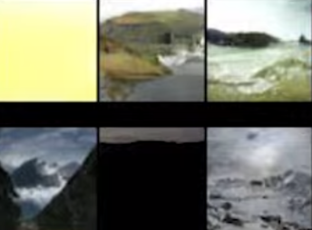

# AI-ImageGeneration

Class- CS330
Professor- Dr. Cao
Names- Cole Stewart, Stuart Gavidia and Jonah Mulcrone
Advisor- TA Chris Holland

For this project we looked at three different image generation models two of which are text-to-image models while the third one was an image-to-image model.

## Model Specifics

### Model #1 (Cole)
- **Name**: CLIP (Contrastive Language–Image Pretraining)
- **Version**: v0.7.1
- **AI Techniques and Algorithms**:
  - **CLIP**: Combines natural language processing and computer vision by learning from a dataset of images and textual descriptions. Suitable for tasks that involve understanding both text and images.
  - **BigGAN**: A Generative Adversarial Network specialized in generating high-quality images. It can create diverse and complex images, making it ideal for tasks requiring visual creativity.

### Model #2 (Stuart)
- **Name**: CLIP with Latent Diffusion Model
- **Version**: min-dalle v0.4.11
- **AI Techniques and Algorithms**:
  - **CLIP**: As above, bridges the gap between text and image understanding.
  - **Latent Diffusion Model**: A type of generative model that creates images by gradually denoising a random input. It's capable of generating detailed and coherent images, useful for tasks requiring image synthesis from textual descriptions.

### Model #3 (Jonah)
- **Name**: Unconditional Denoising Diffusion Probabilistic Model
- **Version**: v2.0
- **AI Techniques and Algorithms**:
  - **Denoising Diffusion Probabilistic Model**: Works by gradually denoising a signal over time, typically used for generating high-quality images.
  - **Image-to-Image Translation**: A technique for converting one type of image into another, maintaining the core structure while changing the style or content. This is particularly effective for tasks requiring adaptation or modification of existing images.
- **Training**: Trained on hundreds of high-resolution images, ensuring the model has learned from a diverse and detailed dataset.

**Suitability for Project Objectives**: 
The primary objective of our project, in collaboration with Chris, is to generate visual stories for children's books by converting text into images. This innovative approach aims to bring stories to life, enhancing the reading experience for young audiences. Here's how each model aligns with our objectives:

- **Model #1 (Cole) and Model #2 (Stuart)**: Both models are equipped with CLIP, enabling a seamless integration of natural language processing and image generation. This feature is crucial for our project as it allows the transformation of textual story elements into vivid, relevant images. Cole's model, with its BigGAN component, excels in generating diverse and high-quality images, which is essential for creating visually appealing and varied illustrations for children's books. Stuart's model, incorporating the Latent Diffusion Model, is adept at producing detailed and coherent images, ensuring that the illustrations are not only captivating but also contextually accurate to the story's narrative.

- **Model #3 (Jonah)**: Although this model does not directly convert text to images, its Unconditional Denoising Diffusion Probabilistic Model is a powerful tool for generating high-quality images. Combined with its Image-to-Image Translation capability, Jonah's model can be used to refine and adapt existing illustrations or to create unique backgrounds and scenes that align with the story's setting. This model can add depth and variety to the visual aspect of our stories, supplementing the primary image generation models.

Integrating these models into a backend server and creating a web application using React allows for a dynamic and interactive platform. Through an API that processes GET requests, users can input story text and receive corresponding images, effectively creating a tailored and immersive storybook. This technological approach not only streamlines the story creation process but also offers a unique and engaging way for children to interact with stories, potentially fostering a deeper interest in reading and storytelling.

## Connection to Coursework

This project is directly related to the key topics covered in our Introduction to AI course, particularly neural networks and clustering. Below are the specifics of how our project exemplifies these principles:

### Neural Networks
- **Application in the Project**: 
  - Our project extensively utilizes neural networks in the form of models like CLIP and BigGAN for image generation and Latent Diffusion Models for image processing.
  - These models are examples of deep learning, a subset of machine learning, which is a core component of neural networks.
- **Coursework Relevance**: 
  - In class, we learned about the architecture of neural networks, including layers, neurons, weights, and activation functions. Our project's models embody these concepts, as they process complex data (text and images) through multiple layers to produce a meaningful output (story images).
  - We also covered how neural networks are trained using large datasets and backpropagation, which is directly applicable to how our project's models have been trained on extensive image and text datasets.

### Clustering
- **Application in the Project**: 
  - While our project primarily focuses on neural networks for image generation, the principles of clustering are relevant in organizing and categorizing large datasets, a preliminary step in training our models.
  - Clustering algorithms can be used to group similar images or text, aiding in more efficient and effective model training.
- **Coursework Relevance**: 
  - Our coursework introduced us to the concept of clustering as a method of unsupervised learning. This is particularly relevant in the context of preparing and preprocessing datasets for neural network training.
  - We discussed various clustering algorithms like K-means and hierarchical clustering. Understanding these algorithms helps in comprehending how data can be segmented and categorized, which is crucial in the data preparation phase of AI projects.

### Principles of AI in the Project
- **Data-Driven Decision Making**: 
  - AI's capability to analyze and learn from data is a core principle reflected in our project. The AI models we are using have been trained on large datasets, enabling them to make informed decisions based on patterns and information extracted from this data.
- **Adaptability and Learning**: 
  - The project demonstrates AI's ability to adapt and learn. As our models encounter new types of text inputs, they can generate images that are contextually aligned with the input, showcasing the learning and adaptability aspect of AI.
- **Interdisciplinary Integration**: 
  - The project is a testament to how AI can integrate with other disciplines like storytelling, education, and art, illustrating the versatile and interdisciplinary nature of AI.

This project not only applies the technical knowledge gained in the course but also demonstrates the broader capabilities and impact of AI in real-world applications.

## Comparative Analysis

In our study, we compared three AI models — BigGAN, Latent Diffusion Model, and Denoising Diffusion at 30 and 300 Epochs — to evaluate their performance in generating images from text. Stuart conducted a blind evaluation to provide an unbiased assessment. Our test prompt was "Snowy Mountain," and here are our findings:

### BigGAN

- **Performance**: BigGAN performed well in creating a "Snowy Mountain" image, though it showed some limitations in creative aspects.
- **Strengths**: It excelled at producing realistic images that closely matched the text description.
- **Weaknesses**: This model required high computational power, ranking second in terms of computer intensity and taking 30 minutes to train and generate an image.
- **Unique Characteristics**: Known for its high-resolution and lifelike image generation, BigGAN lived up to its reputation by producing detailed and visually appealing results.

### Latent Diffusion Model

- **Performance**: This model created an artistic and stylized image, ideal for children's books.
- **Strengths**: It was user-friendly in terms of setup and coding.
- **Weaknesses**: The model had a longer processing time, taking about 10 minutes to generate an image, and required substantial storage space.
- **Unique Characteristics**: It produced more abstract and creatively interpreted images, offering stylistic variety and unique perspectives.

### Denoising Diffusion 30 and 300 Epochs

- **Performance**: The 30-epoch model generally created oversimplified images, often in solid colors. The 300-epoch version showed significant improvement, with more colors and structure related to the text.
- **Strengths**: The model improved markedly with additional training.
- **Weaknesses**: It was the most computationally demanding model, requiring extensive time for training and taking a few days to train and generate an image.
- **Unique Characteristics**: After substantial training (around 250-300 epochs), the model excelled at creating composite images from the trained data.

### Overall Evaluation

- **Blind Evaluation Results**: BigGAN ranked highest in accurately generating images from text, closely followed by the Latent Diffusion Model. The Denoising Diffusion Model showed potential to match BigGAN's performance with more training. The creativity of the Latent Diffusion Model sometimes led to less relevant images.
- **Conclusion**: For our objective of creating children's books, the Latent Diffusion Model stands out for its artistic and imaginative image generation. While other models struggled with more creative prompts, the Latent Diffusion Model's ability to produce unique and engaging images makes it the most suitable choice for our project.

This comparative analysis highlights the strengths and limitations of each model, guiding us in selecting the most appropriate model for specific tasks and scenarios.

## Jupyter Notebook links

Here are the links to the Jupyter Notebooks for the three models:

1. CLIP and BigGan - https://github.com/alpha2phi/jupyter-notebooks/blob/main/nbs/08_clip_biggan.ipynb
2. CLIP and Latent Diffusion Model - https://colab.research.google.com/drive/1EIS7mAu4qcLsoEzQqREuxxaAX9Vmwt7H?usp=sharing#scrollTo=KiyXMyvDjPFk (Only First Part)
3. Unconditional Denoising Diffusion Probabilistic Model (PyTorch w/ CUDA support) - https://github.com/jonahansmulcrone/PyTorch-Stable-Diffusion

## Final Presentation

Final Presentation Link: https://docs.google.com/presentation/d/1cT-EiapUQVmLWxPNazNQwtStXKQl8zrDAmiGNpBnnWs/edit?usp=sharing
